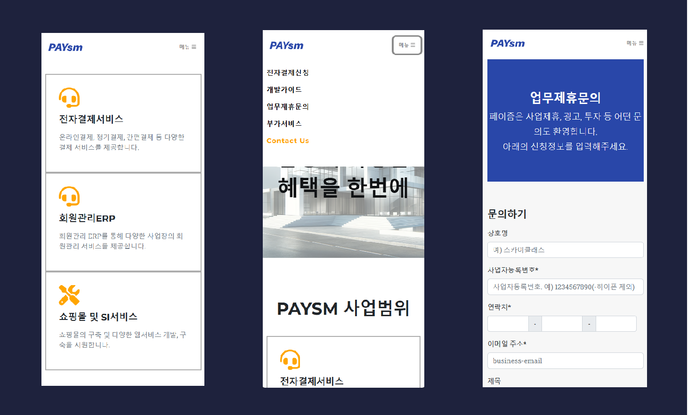

# Former company homepage

This website was created at the request of my previous company.


### <a href="https://paysm.net">Visit a homepage</a>


## Description

Homepage designed with Bootstrap and React js




## Getting Started

### Dependencies

* Chrome or Edge Browser
* Node.js
* NPM

### How To Run

To clone and run this application, you'll need [Git](https://git-scm.com) and [Node.js 18 or higher](https://nodejs.org/en/download/package-manager)

```bash
# Clone this repository
$ git clone https://github.com/tsukemandev/react-homepage.git

# Go into the repository
$ cd react-homepage

# Run npm install
$ npm install

# Run wep app
$ npm start

```


## Technology Stack

* Bootstrap (HTML, CSS)
* React.js (Javascript)


